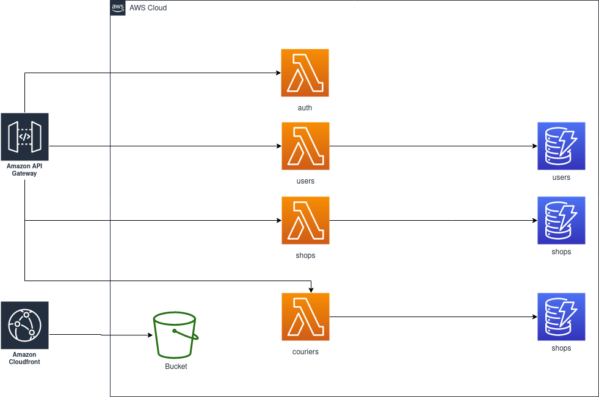

# ze_challenge
## Purpose of this application
This is a serverless approach to the Ze change that was proposed

## High Level Diagram



## Into the code
All the code deployed here consists in two main levels:
- Terraform: Infra as Code
- Lambda: The software Applications that will run

### Lambda
Divided in three parts:
- base_layer: Source code of the layer (shared to the other lambdas). Source code that is used by all lambdas is present there.
- functions: The functions themselves. Each one located inside an exclusive directory.
- test: The function tests. Each test case for each function is inside an exclusive directory.

#### Packing the lambdas
This can be done manually easily, but in order to facilitate the process, each one of the lambdas has a script *pack.sh*.
It can be executed with:

```
cd lambda/functions/DESIRED_FUNCTION
./pack.sh
```

Same thing for the base_layer package (although the script is slightly different)

The script will generate a zip file named *DESIRED_FUNCTION*.zip (*DESIRED_FUNCTION* is the name of the lambda)

### Terraform
Divided in two parts:
- Modules: Collection of reusable modules to provision resources in AWS
- Recipes: The main. Contains the calls to the various modules to provision the necessary resources in AWS.

#### Running terraform
It is as easy as executing a simple apply command:

`terraform apply -var orders_source_code=/path/to/orders.zip -var shops_source_code=/path/to/shops.zip -var couriers_source_code=/path/to/couriers.zip -var users_source_code=./path/to/users.zip -var auth_source_code=/path/to/auth.zip -var base_layer_source_code=/path/to/base_layer.zip -var jws_key_parameter_value="myrandomsecretkey"`

##### Variables explained
There are plenty of variables into [terraform/recipes/vars.tf](terraform/recipes/vars.tf)  and all of them are explained into the description field of each one of the variables.

Most of them have default values, although there some ones that need to be specified exterenally (and this is why the many -var parameters)

All the variables with names ending in "source_code" are paths to zip packages containing a lambda or a layer

*jws_key_parameter_value* is a random value to be assigned to a parameter in the parameter store. This parameter will be used as a secret key to encode JWT and this is why it is important to keep it safe
  
### Using the application
After deploying the application into AWS, it is time to make some use of it.

The API calls with their attributes are described below. All attributes are required.
#### User API

##### POST /users
**Purpose**

Create an user

|Attribute|Type|Example|Description
|---|---|---|---|
|msisdn|string|5511987654321|Mobile phone number|
|password|string|anything123|User password|
|first_name|string|John|User First Name|
|surnames|string|Doe Oliver Silva|All the user surnames| 
|birth_date|integer|315532800|Birth date represented in UNIX epoch time

Returns true when successful and http status 200

##### PUT /users/login
**Purpose**

Authenticates the user into the system


|Attribute|Type|Example|Description
|---|---|---|---|
|msisdn|string|5511987654321|Mobile phone number|
|password|string|anything123|User password|

Returns a session token

##### GET /users/view
**Purpose**

View user data

**Header necessary**:

Authorization: "\<token received from login\>"

|Attribute|Type|Example|Description
|---|---|---|---|
none|

##### PUT /users
**Purpose**

Changes user data

**Header necessary**:


Authorization: "\<token received from login\>"

|Attribute|Type|Example|Description
|---|---|---|---|
|msisdn|string|5511987654321|Mobile phone number|
|first_name|string|John|User First Name|
|surnames|string|Doe Oliver Silva|All the user surnames|
|birth_date|integer|315532800|Birth date represented in UNIX epoch time

Returns true when successful

#### Shop API
##### POST /shops
**Purpose**

Add a shop into the system

|Attribute|Type|Example|Description
|---|---|---|---|
|username|string|anything|Shop admin username|
|password|string|anything123|Shop admin password|
|shopName|string|Corner shop|Shop name|
|address|string|22 Acacia Avenue|Shop address|
|shopStatus|string|Open|One of: Open, Closed
|menu|list(object{item(string), price(number)})|[{"item": "Coca-cola 350 ml", "price": 3.5}]| List of items sold by the shop

Returns true when successful

##### PUT /shops/login
**Purpose**

Authenticate a shop into the system for admin purposes

|Attribute|Type|Example|Description
|---|---|---|---|
|username|string|anything|Shop admin username|
|password|string|anything123|Shop admin password|

Returns a session token

##### GET /shops/view
**Purpose**

View shop data

**Header necessary**:

Authorization: "\<token received from login\>"

|Attribute|Type|Example|Description
|---|---|---|---|
none|

##### PUT /shops/
**Purpose**

Change shop data

**Header necessary**:

Authorization: "\<token received from login\>"

|Attribute|Type|Example|Description
|---|---|---|---|
|username|string|anything|Shop admin username|
|shopName|string|Corner shop|Shop name|
|address|string|22 Acacia Avenue|Shop address|
|shopStatus|string|Open|One of: Open, Closed
|menu|list(object{item(string), price(number)})|[{"item": "Coca-cola 350 ml", "price": 3.5}]| List of items sold by the shop

#### Courier API
##### POST /courier
**Purpose**

Add a courier into the system

|Attribute|Type|Example|Description
|---|---|---|---|
|username|string|anything|Courier admin username|
|password|string|anything123|Courier admin password|
|courierName|string|Anytime Delivery|Courier name|
|address|string|Abbey road 136 |Courier address|
|phone|integer|551133445566|Courier phone

Returns true when successful

##### PUT /couriers/login
**Purpose**

Authenticate a courier into the system for admin purposes

|Attribute|Type|Example|Description
|---|---|---|---|
|username|string|anything|Courier admin username|
|password|string|anything123|Courier admin password|

Returns a session token

##### GET /couriers/view
**Purpose**

View Courier data

**Header necessary**:

Authorization: "\<token received from login\>"

|Attribute|Type|Example|Description
|---|---|---|---|
none|

##### PUT /couriers/
**Purpose**

Change courier data

**Header necessary**:

Authorization: "\<token received from login\>"

|Attribute|Type|Example|Description
|---|---|---|---|
|username|string|anything|Courier admin username|
|courierName|string|Anytime Delivery|Courier name|
|address|string|Abbey road 136 |Courier address|
|phone|integer|551133445566|Courier phone

#### Order API

##### POST /orders
**Purpose**

Place an order

**Header necessary**:

Authorization: "\<token received from Users:login\>"

|Attribute|Type|Example|Description
|---|---|---|---|
|shop_id|string|anything|Shop id|
|items|list(object{item(string), price(number)})|[{"item": "Coca-cola 350 ml", "price": 3.5}]| List of ordered items

##### PUT /orders/update
**Purpose**

**Header necessary**:

Authorization: "\<token received from Shops:login\>"

Update the status of an order (add courier id or change its status)

|Attribute|Type|Example|Description
|---|---|---|---|
|id|string|anything|Order id
|courier_id|string|anything|Courier id|
|orderStatus|string|One of Placed, InTransit, Canceled, Delivered, Confirmed

##### PUT /orders/amend
**Purpose**

Update the items of an order

**Header necessary**:

Authorization: "\<token received from Shops:login\>"

|Attribute|Type|Example|Description
|---|---|---|---|
|id|string|anything|Order id
|items|list(object{item(string), price(number)})|[{"item": "Coca-cola 350 ml", "price": 3.5}]| List of ordered items

##### GET /orders/
**Purpose**
List orders belonging to an user or shop

**Header necessary**:

Authorization: "\<token received from Users:login or Shops: login\>"

If the authentication belongs to a shop, brings orders from a shop, if authentication token belongs to an user, brings the orders placed by this user


#### Postman samples
There is a Postman collection [here](ze_challenge.postman_collection.json) that can be easily imported